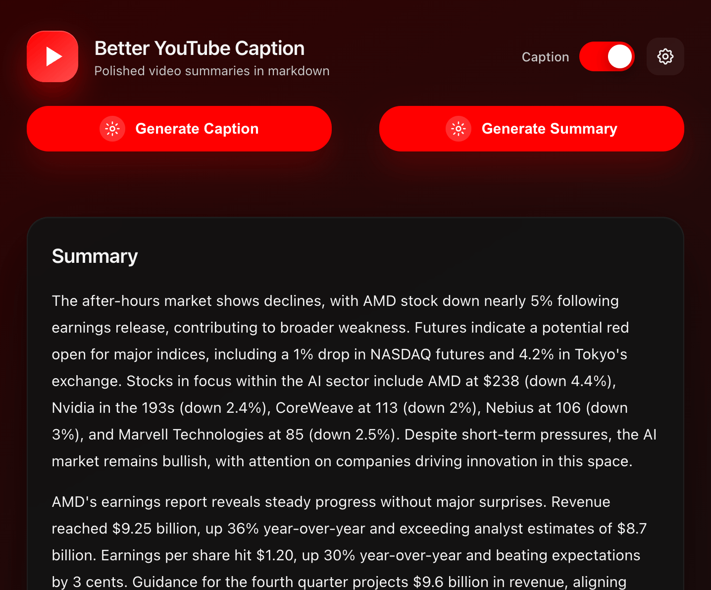
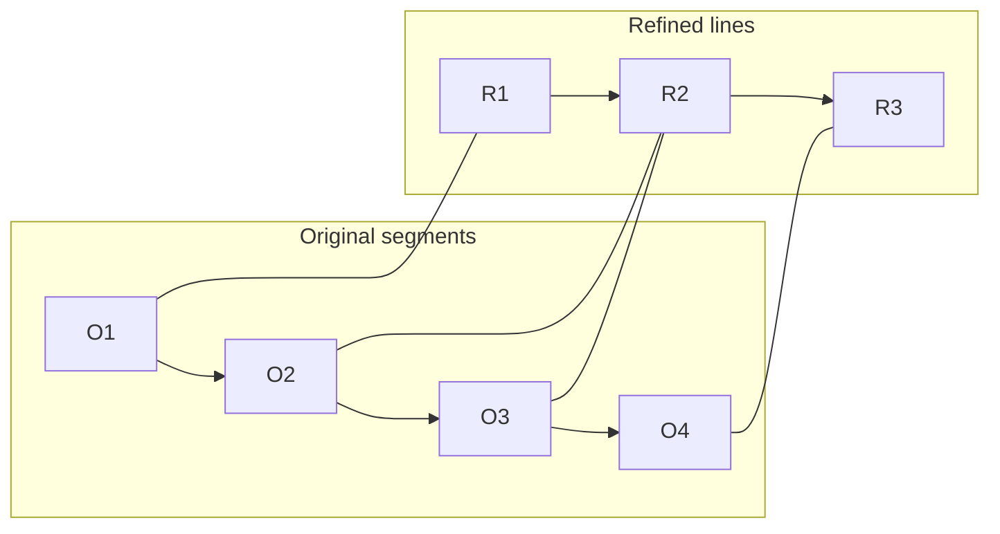
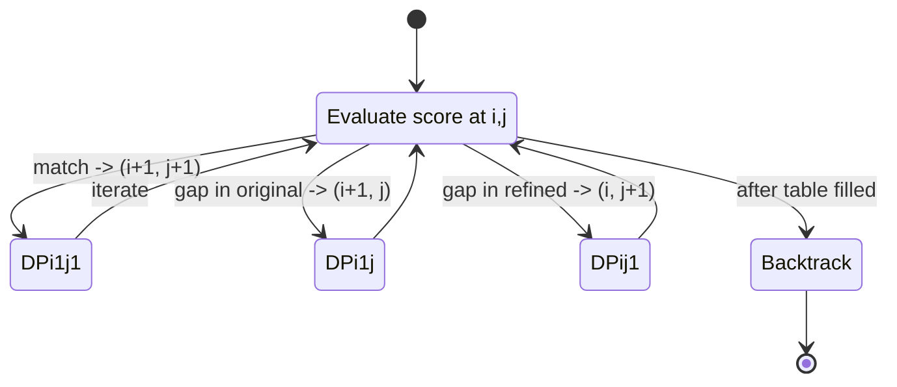

# Better YouTube Caption

<div style="display: flex; gap: 2%; align-items: flex-start;">
  
  
</div>
<br>

YouTube's auto captions keep improving and are often decent, but they still contain typos, missing punctuation, and jittery line changes because they’re produced by near real‑time transcription without much global context. This project uses an LLM to refine those captions into clean, readable subtitles while preserving original timing. The refined transcript also unlocks comprehensive summarization and downstream analysis of the video content.

This extension fetches the transcript reliably via an API (to avoid bot detection), refines it with an LLM through a flexible router, and overlays the improved captions on the YouTube player. Results are cached locally per video for instant reuse.

## Features

- ✨ **AI-Powered Caption Refinement**: Automatically fixes typos and grammar errors in YouTube transcripts using OpenRouter
- 🔄 **Auto-Generation**: Automatically generate and refine captions for new videos
- 💾 **Local Storage**: Captions are cached locally per video for instant playback
- 🎛️ **Model Selection**: Choose separate AI models for summarization and caption refinement from OpenRouter
- 👁️ **Toggle Display**: Show or hide captions on videos with a simple toggle
- 📦 **Smart Storage Management**: Automatic cleanup to manage Chrome's 10MB storage limit
- 🔑 **Your Own API Keys**: Use your Scrape Creators and OpenRouter API keys
- 🧠 **Summarization & Analysis**: Processed captions enable high‑quality summaries and deeper analysis
- 🎨 **Font Size Controls**: Adjust caption and summary font sizes (S/M/L) for better readability

## Installation

### Quick Installation (No Build Required)

The repository includes pre-built bundles, so you can use the extension immediately:

1. **Clone or download** this repository to your local machine.
2. Open Chrome and navigate to `chrome://extensions/`.
3. Enable **Developer Mode** (toggle in the top-right corner).
4. Click **Load unpacked** and select the folder containing this project.
5. The extension will now appear in your Chrome extensions list.

**That's it!** The bundles are already included in the repository, so no build step is required.

### Development Setup (Optional)

If you want to modify the code or rebuild bundles:

1. **Install dependencies**:
   ```bash
   npm install
   ```
2. **Build bundles** (if you modify any source files in `src/`):
   ```bash
   npm run build
   ```
   This regenerates the bundles in `dist/` (`background.bundle.js`, `content.bundle.js`, `popup.bundle.js`).

**Development**: Use `npm run build:watch` for auto-rebuild during development.

**Note**: For regular users, the pre-built bundles included in the repository are sufficient. Only rebuild if you're making code changes.

## Setup

1. **Get API Keys**:
   - [Scrape Creators API](https://scrapecreators.com/) - For fetching YouTube transcripts
   - [OpenRouter API](https://openrouter.ai/) - For AI-powered caption refinement

2. **Configure the Extension**:
   - Click the extension icon in your Chrome toolbar
   - Go to **Settings** tab
   - Enter your Scrape Creators API key (required)
   - Enter your OpenRouter API key (required for refinement and summarization)
   - Select your preferred AI models:
     - **Summarizer Model** (default: `x-ai/grok-4.1-fast`) - for generating summaries
     - **Refiner Model** (default: `google/gemini-2.5-flash-lite-preview-09-2025`) - for refining captions
   - Adjust font sizes for captions and summaries (S/M/L)
   - Click **Save Settings**

## How to Use

### Manual Generation
1. Navigate to any YouTube video
2. Click the extension icon
3. Click **Generate Subtitles**
4. Wait for processing (transcript fetching + AI refinement)

### Auto-Generation
1. Enable **Auto-generate subtitles for new videos** toggle
2. Navigate to any YouTube video
3. Captions will automatically generate after a short delay

### Generate Summary
1. Navigate to any YouTube video
2. Click the extension icon
3. Click **Generate Summary**
4. Wait for processing (transcript fetching + AI summarization)
5. Summary appears in popup (no reload needed)

### Toggle Display
- Use the **Show subtitles on video** toggle to show/hide captions
- Setting persists across page reloads

### Font Size Controls
- Adjust caption font size (S/M/L) in Settings - changes apply immediately to video captions
- Adjust summary font size (S/M/L) in Settings - changes apply to summary display in popup

## Segment Parser Algorithm

Real-world problem: one-shot LLM generations often reorder, merge, or drop a few lines, and asking an LLM to emit a perfectly structured JSON for hundreds of timestamped fields is brittle and slow. Instead, this project refines text freely and then maps it back to the original timestamps with a dynamic-programming (DP) alignment algorithm.

Key idea: treat the original segments (with timestamps) and the refined text lines as two sequences and compute the best alignment. Gaps model merges/splits, and a similarity score selects the most plausible matches.

Illustrative views:

Alignment view (example merges/splits):



DP transition logic (conceptual):



Algorithm highlights:

- Similarity function mixes character-overlap (70%) and token-level Jaccard (30%).
- DP is Needleman–Wunsch–style with a small negative gap penalty to allow merges/splits.
- Tail guard protects boundary items near the end of a processed block: if the refined line’s length deviates by more than 10%, we fall back to the original text for stability.
- Works even when the LLM slightly reorders or merges lines; no need for fragile mega-JSON outputs.

Internal config knobs (in `segmentParser.js`):

- `GAP_PENALTY`: controls willingness to insert gaps (handle merges/splits).
- `TAIL_GUARD_SIZE`: number of trailing items guarded per block.
- `LENGTH_TOLERANCE`: max relative length drift allowed in tail before reverting.

Complexity:

- Per alignment it’s `O(n * m)` for `n` original segments and `m` refined lines. With chunking, each chunk is small so it stays fast.

Public API:

```js
// Choose automatically between chunked and global alignment
const aligned = parseRefinedSegments(
  refinedText,           // string from LLM (may include chunk sentinels)
  originalSegments,      // [{ text, startMs, endMs, startTimeText }, ...]
  CHUNK_SENTINEL,        // the same sentinel used during generation
  MAX_SEGMENTS_PER_CHUNK // e.g., 40–80
);

// Returns the same number of segments as originals, but with refined text
// and original timestamps preserved.
```