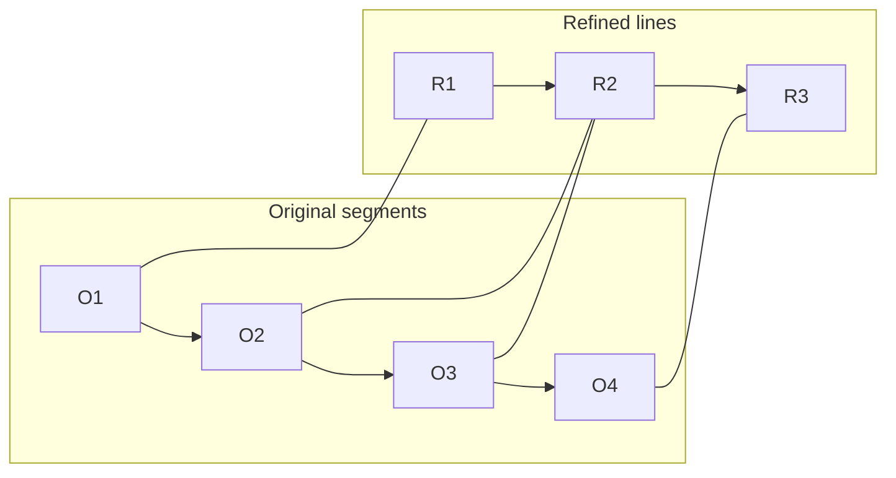
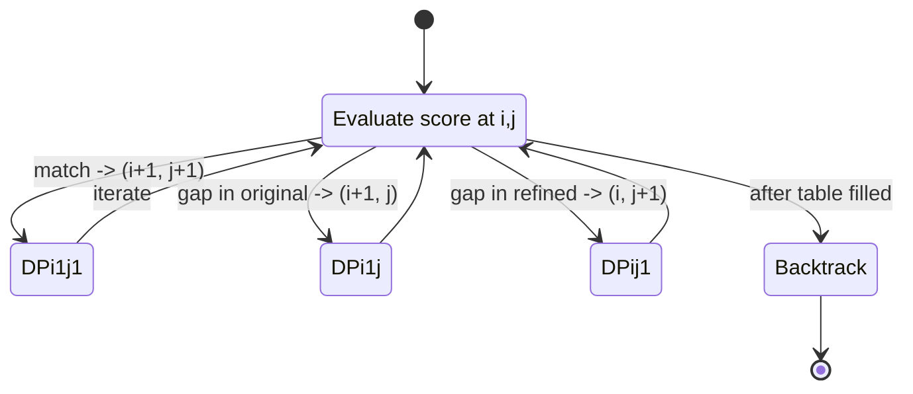

# Better YouTube Caption

A Chrome extension that enhances YouTube video captions by automatically refining transcripts using AI. Captions are stored locally for instant access when revisiting videos.

## Features

- ✨ **AI-Powered Caption Refinement**: Automatically fixes typos and grammar errors in YouTube transcripts using OpenRouter (Gemini, GPT-4, etc.)
- 🔄 **Auto-Generation**: Automatically generate and refine captions for new videos (toggleable)
- 💾 **Local Storage**: Captions are cached locally per video for instant playback
- 🎛️ **Model Selection**: Choose your preferred AI model from OpenRouter
- 👁️ **Toggle Display**: Show or hide captions on videos with a simple toggle
- 📦 **Smart Storage Management**: Automatic cleanup to manage Chrome's 10MB storage limit
- 🔑 **Your Own API Keys**: Use your Scrape Creators and OpenRouter API keys

## Installation

1. Clone or download this repository to your local machine.
2. Open Chrome and navigate to `chrome://extensions/`.
3. Enable **Developer Mode** (toggle in the top-right corner).
4. Click **Load unpacked** and select the folder containing this project.
5. The extension will now appear in your Chrome extensions list.

## Setup

1. **Get API Keys**:
   - [Scrape Creators API](https://scrapecreators.com/) - For fetching YouTube transcripts
   - [OpenRouter API](https://openrouter.ai/) - For AI-powered caption refinement

2. **Configure the Extension**:
   - Click the extension icon in your Chrome toolbar
   - Enter your Scrape Creators API key (required)
   - Enter your OpenRouter API key (optional, for refinement)
   - Select your preferred AI model (default: `google/gemini-2.5-flash-lite`)

## How to Use

### Manual Generation
1. Navigate to any YouTube video
2. Click the extension icon
3. Click **Generate Subtitles**
4. Wait for processing (transcript fetching + AI refinement)

### Auto-Generation
1. Enable **Auto-generate subtitles for new videos** toggle
2. Navigate to any YouTube video
3. Captions will automatically generate after a short delay

### Toggle Display
- Use the **Show subtitles on video** toggle to show/hide captions
- Setting persists across page reloads

## Project Structure

```
better-youtube-caption/
├── src/                    # Core library code
│   ├── constants.js       # Configuration constants
│   ├── storage.js         # Storage management utilities
│   ├── transcript.js      # Transcript fetching & refinement
│   ├── segmentParser.js   # Robust alignment of refined text to timestamps
│   └── url.js             # URL manipulation utilities
├── background.js          # Service worker (API calls, storage)
├── content.js             # Content script (subtitle display)
├── popup.html             # Extension popup UI
├── popup.js               # Popup logic and event handlers
├── subtitles.css          # Subtitle styling
├── manifest.json          # Extension manifest
└── config.js             # Development config (optional)
```

## File Overview

### Core Files

**`manifest.json`**
- Defines extension metadata, permissions, and resources
- Specifies background service worker, content scripts, and popup

**`background.js`**
- Service worker handling API communication
- Manages transcript fetching (Scrape Creators API)
- Coordinates AI refinement (OpenRouter API)
- Handles storage operations and cleanup

**`content.js`**
- Runs on YouTube pages
- Manages subtitle display and synchronization
- Handles auto-generation logic
- Listens for user interactions

**`popup.html` & `popup.js`**
- Extension popup interface
- API key configuration
- Model selection
- Toggle controls (auto-generation, show/hide)

### Source Library (`src/`)

**`constants.js`**
- Centralized configuration constants
- Storage keys, timing values, defaults, API endpoints

**`storage.js`**
- Chrome storage management
- Quota handling and cleanup
- Video transcript storage operations

**`transcript.js`**
- Transcript fetching from Scrape Creators API
- AI refinement via OpenRouter
- Format conversion and parsing

**`segmentParser.js`**
- Robust alignment of refined text to timestamps (DP-based)
- Converts refined free-form lines back onto original time segments

**`url.js`**
- YouTube URL manipulation
- Video ID extraction

## Storage Management

The extension uses Chrome's `chrome.storage.local` API with a 10MB limit:
- **Quota Management**: Automatic cleanup when storage exceeds 9MB
- **Smart Cleanup**: Removes oldest videos when space is needed
- **Per-Video Storage**: Each video's transcript is stored with its video ID as the key

## Technical Details

### API Integration

**Scrape Creators API**
- Fetches YouTube video transcripts with timestamps
- Includes video metadata (title, description)

**OpenRouter API**
- Provides access to multiple providers and LLMs
- Prioritizes throughput for faster processing
- Uses system prompts to preserve transcript structure

### Caption Display

- Synchronized with video playback
- Updates every 100ms for smooth transitions
- Hidden when video is paused
- Respects user toggle preferences

### Segment Parser

Real-world problem: one-shot LLM generations often reorder, merge, or drop a few lines, and asking an LLM to emit a perfectly structured JSON for hundreds of timestamped fields is brittle and slow. Instead, this project refines text freely and then maps it back to the original timestamps with a dynamic-programming (DP) alignment algorithm.

Key idea: treat the original segments (with timestamps) and the refined text lines as two sequences and compute the best alignment. Gaps model merges/splits, and a similarity score selects the most plausible matches.

Illustrative views:

Alignment view (example merges/splits):



DP transition logic (conceptual):



Algorithm highlights:

- Similarity function mixes character-overlap (70%) and token-level Jaccard (30%).
- DP is Needleman–Wunsch–style with a small negative gap penalty to allow merges/splits.
- Tail guard protects boundary items near the end of a processed block: if the refined line’s length deviates by more than 10%, we fall back to the original text for stability.
- Works even when the LLM slightly reorders or merges lines; no need for fragile mega-JSON outputs.

Important knobs (see `SEGMENT_PARSER_CONFIG`):

- `GAP_PENALTY`: controls willingness to insert gaps (handle merges/splits).
- `TAIL_GUARD_SIZE`: number of trailing items guarded per block.
- `LENGTH_TOLERANCE`: max relative length drift allowed in tail before reverting.

Complexity:

- Per alignment it’s `O(n * m)` for `n` original segments and `m` refined lines. With chunking, each chunk is small so it stays fast.

Public API:

```js
// Choose automatically between chunked and global alignment
const aligned = parseRefinedSegments(
  refinedText,           // string from LLM (may include chunk sentinels)
  originalSegments,      // [{ text, startMs, endMs, startTimeText }, ...]
  CHUNK_SENTINEL,        // the same sentinel used during generation
  MAX_SEGMENTS_PER_CHUNK // e.g., 40–80
);

// Returns the same number of segments as originals, but with refined text
// and original timestamps preserved.
```

